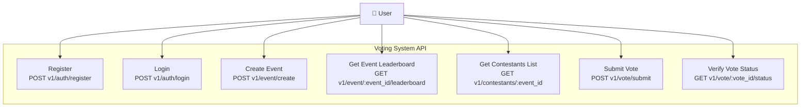

# Voting System API - Use Case Diagram

## API Endpoints

### Authentication

#### Register
- **Method**: POST
- **Path**: `v1/auth/register`
- **Purpose**: Create new user account

#### Login
- **Method**: POST
- **Path**: `v1/auth/login`
- **Purpose**: Authenticate user and obtain session/token

### Event Management

#### Create Event
- **Method**: POST
- **Path**: `v1/event/create`
- **Purpose**: Create new voting event

#### Get Event Leaderboard
- **Method**: GET
- **Path**: `v1/event/{event_id}/leaderboard`
- **Purpose**: Retrieve real-time vote counts for event

#### Get Contestants List
- **Method**: GET
- **Path**: `v1/contestants/{event_id}`
- **Purpose**: List all contestants/candidates for an event

### Voting

#### Submit Vote
- **Method**: POST
- **Path**: `v1/vote/submit`
- **Purpose**: Submit vote for contestant in event

#### Verify Vote Status
- **Method**: GET
- **Path**: `v1/vote/{vote_id}/status`
- **Purpose**: Check status and confirmation of submitted vote
