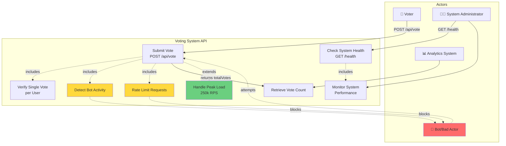

# Voting System API - Use Case Diagram



## Primary Use Cases

### 1. Submit Vote
- **Actor**: Voter
- **Endpoint**: `POST /api/vote`
- **Request**:
  ```json
  {
    "userId": "user123",
    "candidateId": "candidate456"
  }
  ```
- **Response**:
  ```json
  {
    "success": true,
    "message": "Vote recorded successfully",
    "totalVotes": 42
  }
  ```
- **Requirements**:
  - Handle 250k RPS peaks
  - Support 300M users
  - Never lose data

### 2. Verify Single Vote per User
- **Type**: Security constraint (included in Submit Vote)
- **Mechanism**: Redis cache for deduplication
- **Requirement**: Each user can vote only once

### 3. Check System Health
- **Actor**: System Administrator
- **Endpoint**: `GET /health`
- **Response**:
  ```json
  {
    "status": "UP",
    "service": "service-name-voting-poc"
  }
  ```

### 4. Detect Bot Activity
- **Type**: Security constraint (included in Submit Vote)
- **Purpose**: Prevent bots and bad actors
- **Mechanisms**:
  - Rate limiting
  - Request validation
  - Pattern detection

### 5. Rate Limit Requests
- **Type**: Security/Performance constraint
- **Purpose**: Protect against abuse and ensure fair resource distribution
- **Implementation**: API Gateway (NGINX Plus)

### 6. Retrieve Vote Count
- **Actor**: Analytics System, Voter (via response)
- **Type**: Real-time aggregation
- **Requirement**: Provide real-time vote counts

### 7. Monitor System Performance
- **Actor**: System Administrator
- **Type**: Operational monitoring
- **Metrics**:
  - RPS throughput
  - P95/P99 latency
  - Error rates
  - Resource usage

### 8. Handle Peak Load
- **Type**: Performance requirement (extends Submit Vote)
- **Requirement**: Process 250k requests per second
- **Implementation**: Horizontal scaling with Kafka/MSK and Redis

## System Boundaries

### Included in API:
- Vote submission and validation
- Health monitoring
- Real-time vote counting
- Bot detection and rate limiting

### External Dependencies:
- **Message Queue**: Kafka/MSK for vote processing
- **Cache**: Redis/ElastiCache for deduplication
- **API Gateway**: NGINX Plus for rate limiting and routing
- **Application**: Spring Boot/Go/Rust implementations

## Non-Functional Requirements

1. **Scalability**: Handle 300M users and 250k RPS
2. **Reliability**: Never lose vote data
3. **Security**: Prevent bots and ensure one vote per user
4. **Performance**: Real-time vote counting and results
5. **Availability**: High uptime with health monitoring
